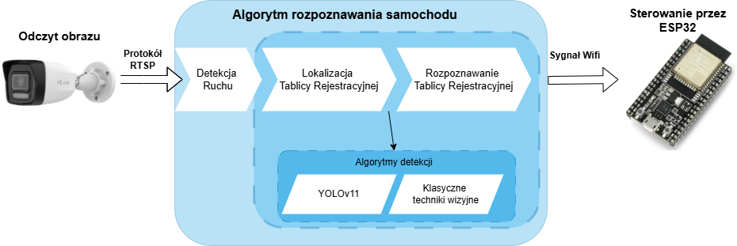
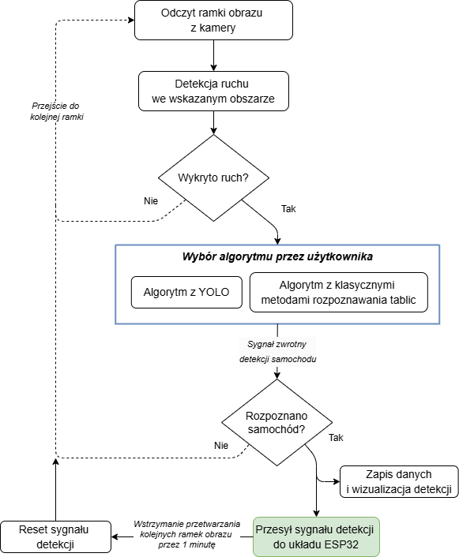
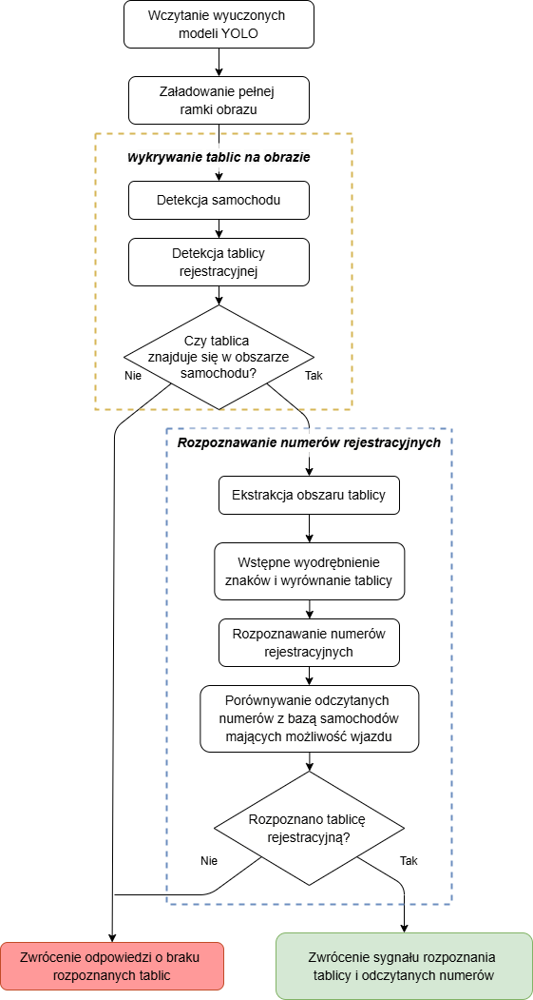
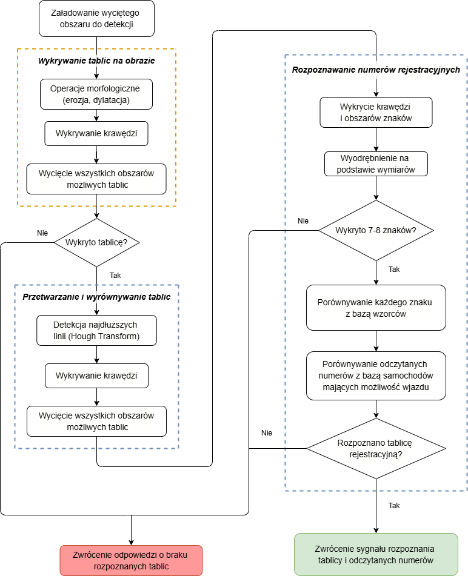
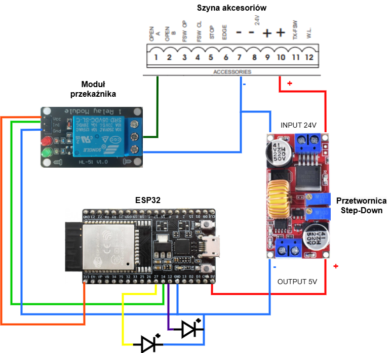

# Vision-based control system for car entrance gate
 The project involved constructing a video system to control an entrance gate. 
 The image from an IP camera mounted above the gate was read via RTSP protocol. 
 One of two license plate recognition algorithms then processed the image to extract the license plate number and compared it to the plates stored in the database. 
 The first algorithm implemented classic computer vision techniques using the resources of the OpenCV library. 
 The second algorithm was based on the use of a deep YOLO neural network to recognize the car, license plate and alphanumeric characters from the plate sequentially. 
 In the final stage of operation, the system sent the car recognition signal to an ESP32 microcontroller connected to the gate control module, allowing the gate to be opened.

System was constructed and working on PC.

## System construction
### main.py
The main program file contains code responsible for reading the image (optionally: by RTSP or loaded video) and extracting the motion detection area. 
If motion of sufficient intensity is detected in the area, the system initializes the selected algorithm. Recognition of a vehicle accessing the property automatically sends a recognition signal to the esp32 system. 
It also causes the system to pause the processing of subsequent image frames for a specified time, after which the gate is automatically closed.  

All detection results and the produced videos displaying the detections are saved in a csv file when the program is interrupted or terminated.

### Neural network alghoritm (NN_main.py)
The program code in which the YOLO algorithm is implemented contains 4 important detection stages using learned detecision models: car location, plate location in the car area, license plate alignment and character recognition. 
If the plate numbers match any numbers available in the database, a recognition signal is returned.

### Classical vision methods (classical_method.py)
The second license plate recognition algorithm implements classic computer vision techniques. 
In the cut-out detection area, a potential license plate is localized using various morphological operations and edge detection methods. 
Each potential plate is aligned when the plate's border lines are located. 
The cropped and aligned image is segmented to extract characters for recognition.
The extracted individual characters are compared with a master image database. 
The most matching numbers are written down and then compared to the database of available license plates. 
In case of recognition, the corresponding detection signal is returned.

### ESP32 code (connection_to_python.ino)
Opening or closing gate signal is received by a microcontroller connected to the local network via Wi-Fi. If the chip has a stable LAN connection, the blue LED lights up. 
The microcontroller receives two signals: “on” and ‘off,’ acting identically but sending separate feedback on whether to open or close the gate.
A connection error is also communicated accordingly in the program on the computer. 
The control signal is set to a normally HIGH level, changing to LOW for 0.5 s in case of a corresponding override from the main program. 
The control is also indicated by a green LED flashing when the state of the control pin changes.

### Gate control electrical connection
The gate control system consists of:
- Step-down dc-dc converter, changing the voltage from 24v to 5V
- An esp32 microcontroller
 -A relay powered at 3.3V, controlled by a low state

## Results of system evaluation

# Table: Comparison of Vehicle Recognition Algorithms during daytime for recording in two different resolutions and fps ratios.
| **Resolution** | **Frames per Second** | **Detections (Classic)** | **Detections (YOLO)** | **Average Confidence (Classic)** | **Average Confidence (YOLO)** | **Average Detection Time [s] (Classic)** | **Average Detection Time [s] (YOLO)** |
|----------------|------------------------|---------------------------|------------------------|-----------------------------------|--------------------------------|------------------------------------------|---------------------------------------|
| 1920x1080      | 2                      | 3                         | 5                      | 80%                              | 90%                            | 0.09                                     | 0.59                                  |
| 1920x1080      | 4                      | 7                         | 14                     | 79%                              | 88%                            | 0.12                                     | 0.46                                  |
| 2560x1440      | 2                      | 3                         | 5                      | 78%                              | 89%                            | 0.19                                     | 0.44                                  |
| 2560x1440      | 4                      | 4                         | 16                     | 78%                              | 90%                            | 0.19                                     | 0.46                                  |

# Table: Detailed summary of detection results for daytime testing in foggy conditions
The car changed its speed (if not specified, it was 8 km/h) and driving path.
Video was set to capture 8 fps.

| **Resolution** | **Driving Path**                | **Detections (Classic)** | **Detections (YOLO)** | **Average Confidence (Classic)** | **Average Confidence (YOLO)** | **Average Detection Time [s] (Classic)** | **Average Detection Time [s] (YOLO)** |
|----------------|---------------------------------|---------------------------|------------------------|-----------------------------------|--------------------------------|------------------------------------------|---------------------------------------|
| **1920x1080**  | Center of the road (8 km/h)     | 1                         | 35                     | 94%                               | 92%                            | 0.05                                     | 0.49                                  |
| **1920x1080**  | Center of the road (10 km/h)    | 1                         | 30                     | 88%                               | 91%                            | 0.08                                     | 0.48                                  |
| **1920x1080**  | Center of the road (12 km/h)    | 0                         | 29                     | ---                               | 91%                            | ---                                      | 0.49                                  |
| **1920x1080**  | Right side of the road          | 3                         | 33                     | 86%                               | 92%                            | 0.07                                     | 0.46                                  |
| **1920x1080**  | Left side of the road           | 0                         | 29                     | ---                               | 92%                            | ---                                      | 0.60                                  |
| **2560x1440**  | Center of the road (8 km/h)     | 1                         | 36                     | 86%                               | 92%                            | 0.19                                     | 0.50                                  |
| **2560x1440**  | Center of the road (10 km/h)    | 2                         | 33                     | 87%                               | 92%                            | 0.09                                     | 0.49                                  |
| **2560x1440**  | Center of the road (12 km/h)    | 1                         | 25                     | 85%                               | 92%                            | 0.08                                     | 0.48                                  |
| **2560x1440**  | Right side of the road          | 3                         | 34                     | 86%                               | 92%                            | 0.08                                     | 0.47                                  |
| **2560x1440**  | Left side of the road           | 1                         | 35                     | 87%                               | 92%                            | 0.08                                     | 0.47                                  |

# Table: Summary of License Plate Recognition results at night for a stationary car with varying exposure settings
| **Exposure Settings** | **Average Confidence (Classic)** | **Average Confidence (YOLO)** | **Average Detection Time [s] (Classic)** | **Average Detection Time [s] (YOLO)** |
|------------------------|----------------------------------|--------------------------------|-------------------------------------------|----------------------------------------|
| 1/150                 | ---                              | 89%                            | ---                                       | 0.94                                   |
| 1/200                 | ---                              | 92%                            | ---                                       | 0.77                                   |
| 1/250                 | 78%                              | 92%                            | 0.11                                      | 3.07                                   |
| 1/2000                | 82%                              | ---                            | 0.12                                      | ---                                    |
